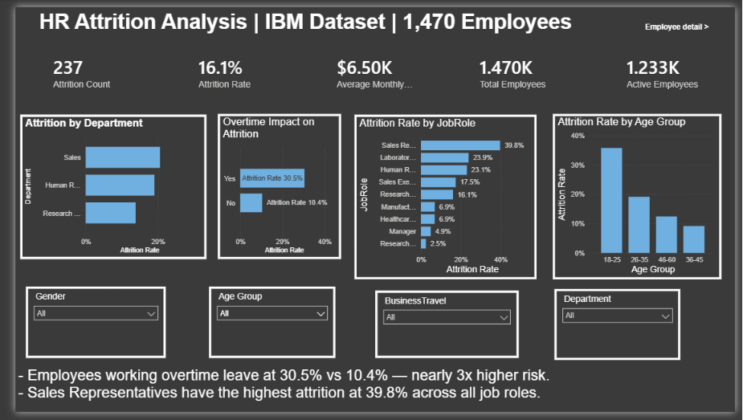
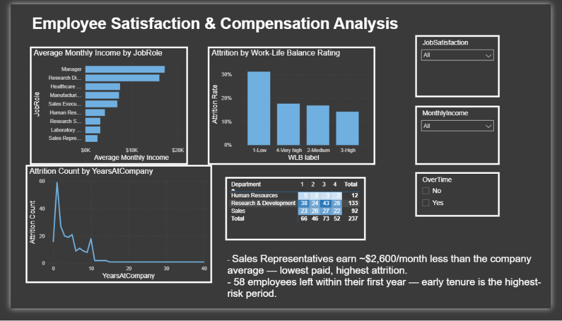

# HR Analytics Dashboard 
 
## Business Problem 
A company with 1470 employees has a 16.1%% annual attrition rate. 
This project identifies root causes of attrition. 
 
## Tools Used 
Python, Power BI, DAX 
 
## Key Findings 
- Overtime workers churn at 30.5%% vs 10.4%% 
- Sales Representatives have highest attrition at 39.8%% 
- 58 employees left within first year 
 
## Dashboard Preview 
 

